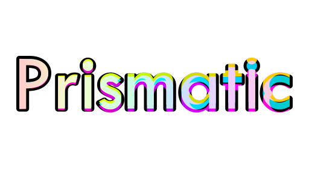

# Prismatic

A simple game demo I designed for CS 455 at BYU. In Prismatic, you control a nameless character who uses color switches
to manipulate what you can see and what's really there.

Written in C++ and OpenGL using GLFW for window management and Assimp for loading models.

